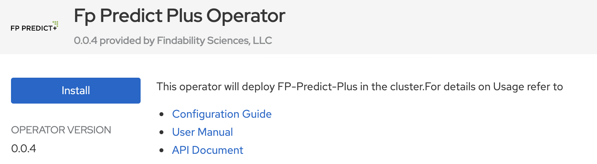
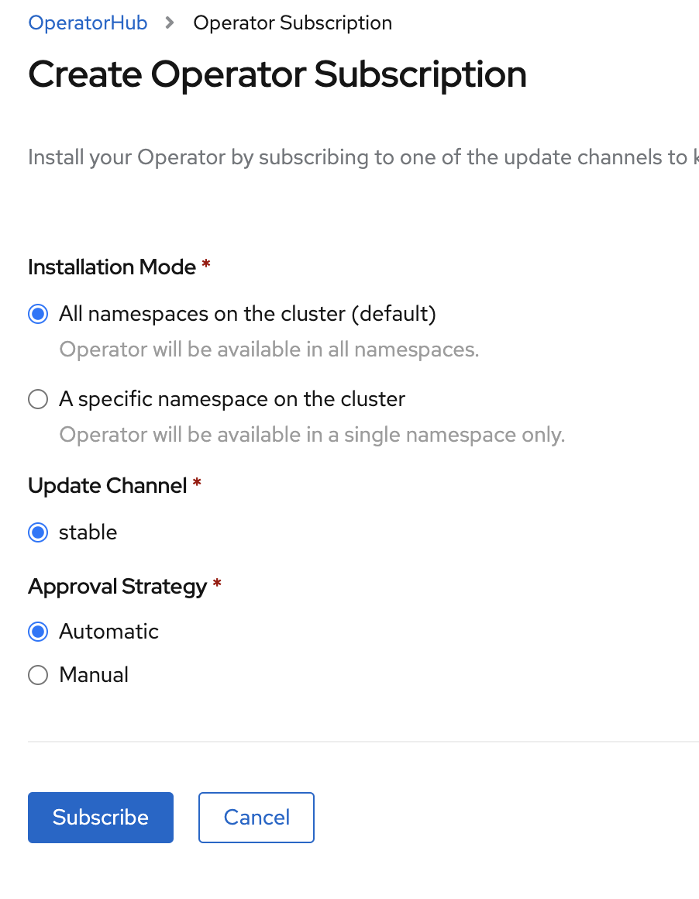
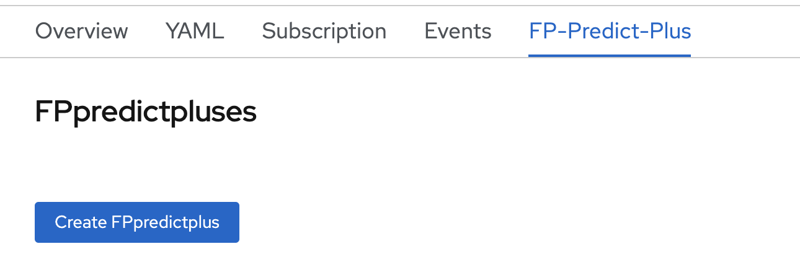
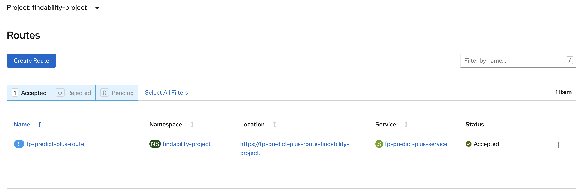

# How to install & get started using the Crunchy Postgres operator on RedHat OpenShift cluster

In this tutorial, we demonstrate how to install and get started using the Crunchy Postgres operator operator from RedHat Marketplace (RHM). The advantages of using RHM operators are per below.  

* `Software for any cloud` :- Enterprise software for container-based environments in public clouds and on-prem

* `Automated deployment` :- Fast, integrated experience with instant availability on Red Hat® OpenShift® clusters

* `Fully supported` :- Free, continuous support for products purchased through Red Hat Marketplace

## A short brief about Crunchy Postgres operator operator

The postgres-operator is a controller that runs within a Kubernetes cluster that provides a means to deploy and manage PostgreSQL clusters.
Use the postgres-operator to:
- deploy PostgreSQL containers including streaming replication clusters
- scale up PostgreSQL clusters with extra replicas
- add pgpool, pgbouncer, and metrics sidecars to PostgreSQL clusters
- apply SQL policies to PostgreSQL clusters
- assign metadata tags to PostgreSQL clusters
- maintain PostgreSQL users and passwords
- perform minor upgrades to PostgreSQL clusters
- load simple CSV and JSON files into PostgreSQL clusters
- perform database backups

## Prerequisites

For all operators being installed from RHM, OpenShift cluster version 4.3 or higher is mandatory. Please set up Classic cluster using the instructions from below URL.

[Setting up OpenShift Cluster](https://cloud.ibm.com/docs/openshift?topic=openshift-getting-started)

## Next Step - Access the RedHat OpenShift Container Platform (Web Console)

Follow the steps below to launch the cluster console which is also called RedHat OpenShift Container Platform.

Login to IBM Cloud Account and navigate to Dashboard

Click on Clusters and select the cluster which you have created under prerequisites. In our case, cluster name is cp-rhm-poc.

After you launch the cluster, click on OpenShift web console on the top right hand side.

We can see the RedHat OpenShift Container Platform (Web Console). Click on question mark ikon on the top right hand side and select Command Line Tools. 

Navigate to the section `oc - OpenShift Command Line Interface (CLI)` and download the respective oc binary onto your local system. This is needed to manage OpenShift projects from a terminal and is further extended to natively support OpenShift Container Platform features.

We are all set to proceed to next step which is to register the OpenShift cluster on RedHat Marketplace platform. This is mandatory to install any operators from RedHat Marketplace platform using the OpenShift cluster.

## Register the cluster on RedHat Marketplace

Sign up and login to RHM portal at [Link](https://marketplace.redhat.com/en-us) and click on workspace and then click on cluster. We need to add our new OpenShift cluster and register it on RHM platform.

Update the cluster name, generate the pull secret as per the instructions and save it. 

Copy the curl command which starts with `curl -sL https` and append the pull secret towards the end. The entire script should be handy to be used in next step.

We need to start the cluster first to register it. Open a command prompt and type oc login, update the username and password which are used for accessing the cluster and hit enter. 

The cluster is up and running at this point. We need to run the entire script which is from previous step and hit enter. It will take a couple of mins and we can see that we have successfully registered the cluster on RHM portal.

## Create a project in web console

We need to create a project to be used and managed from command line. Click on Create Project and give a name as `findability-project`.

## Install the operator

Navigate to OpenShift web console which was launched during previous step. Select operatorhub under Operators and type FP in the search bar and hit 

Click on Fp Predict Plus Operator (non custom) and hit install.

`Note` :- This is a trial instance with the following constraints per below.

1. Up to 100K rows in training data and up to 50K rows in prediction data
2. Up to 500 variables, features and columns
3. 30 days free trial

Create Operator Subscription by choosing All namespaces or specific namespace (select findability-project) and hit subscribe.

After a couple of minutes, the operator gets installed on the cluster. We can verify by clicking on Installed Operators under `Operators` and see that the operator is successfully installed with status showing as Succeeded.

## Create storage for the operator

We need to create persistent volume in the name of `fp-predict-plus-pv` to be bound to persistent volume claims. This step is necessary to enable storage capabilities for the operator to manage datasets. Click on persistent volume under Storage, update the name as `fp-predict-plus-pv` and storage capacity as 20 GB and hit `Create`. If we need more storage, we can increase it in the YAML file and create the persistent volume accordingly.

We need to create a persistent volume claim (storage) to use the storage created in previous step and bind it to the instance of this operator. Click on storage under Web Console and select Persistent Volume Claims.

The next step is to create persistent volume claim. We can select Storage Class from Gold, Silver, Bronze which was created in previous step, give the name as `fp-predict-plus-pvc`, select single user access & assign the storage size as 20 GB. 

After the persistent volume claim (PVC) is created, it needs to be bound with the persistent volume (PV) which was created in earlier step. We should see the status as `Bound` per below after couple of minutes.

## Install the operand (Instance) of FPPredict Plus

Click on Installed operators under `Operators` and click on FP Predict Plus Operator to get the options like Overview, YAML, Subscription, Events, FP-Predict-Plus. Click on YAML and update the name per below under persistent volume with `useExisting as false`, name of persistent volume claims, routerCanonicalHostname would be the web console URL and hit `Save`. routerCanonicalHostname would start with the cluster name, cluster id till appdomain.cloud. The initial part in the URL - `https://console-openshift-console` should be removed while updating routerCanonicalHostname.

The next step is to proceed towards FP-Predict-Plus option and click on Create FPpredictplus instance. Edit the YAML file and give a name for the instance and click `Save`.

## Launch the operand (Instance) of FPPredict Plus

We are all set to launch the instance. How do we do it? We need to click on Networking and select Routes and then click on the URL which is under the location to launch the instance. 

## Register the instance of FPPredict Plus

We can login using the default credentials as per the [configuration file](https://github.com/IBM/getting-started-with-fppredictplus/blob/master/credentials.txt), accept the end user license agreement and will be directed automatically to register the instance with the trial version license key.

### With this, we have come to the end of this tutorial to understand all the aspects of installation, configuration, setup and more to get started using the FPPredict Plus operator from RedHat Marketplace on OpenShift cluster to solve usecases under AI. 

