---
#Front matter (metadata).
abstract:               # REQUIRED

authors:
 - name: "Rahul Reddy Ravipally"
   email: "raravi86@in.ibm.com"
 - name: "Manoj Jahgirdar"
   email: "manoj.jahgirdar@in.ibm.com"
 - name: "Srikanth Manne"
   email: "srikanth.manne@in.ibm.com"
 - name: "Manjula G. Hosurmath"
   email: "mhosurma@in.ibm.com"

completed_date: 2020-07-03

components:
- slug: "Crunchy PostgreSQL for Kubernetes"
  name: "Crunchy PostgreSQL for Kubernetes"
  url: "https://marketplace.redhat.com/en-us/products/crunchy-postgresql-for-kubernetes"
  type: "component"
- slug: "redhat-marketplace"
  name: "Red Hat Marketplace"
  url: "https://marketplace.redhat.com/"
  type: "component"

draft: true|false       # REQUIRED

excerpt:                # REQUIRED

keywords:               # REQUIRED - comma separated list

last_updated:           # REQUIRED - Note: date format is YYYY-MM-DD

primary_tag:          # REQUIRED - Note: Choose only only one primary tag. Multiple primary tags will result in automation failure. Additional non-primary tags can be added below.

pta:                    # REQUIRED - Note: can be only one
# For a full list of options see https://github.ibm.com/IBMCode/Definitions/blob/master/primary-technology-area.yml
# Use the "slug" value found at the link above to include it in this content.
# Example (remove the # to uncomment):
 # - "cloud, container, and infrastructure"

pwg:                    # REQUIRED - Note: can be one or many
# For a full list of options see https://github.ibm.com/IBMCode/Definitions/blob/master/portfolio-working-group.yml
# Use the "slug" value found at the link above to include it in this content.
# Example (remove the # to uncomment):
# - "containers"

related_content:        # OPTIONAL - Note: zero or more related content
  - type: announcements|articles|blogs|patterns|series|tutorials|videos
    slug:

related_links:           # OPTIONAL - Note: zero or more related links
  - title:
    url:
    description:

runtimes:               # OPTIONAL - Note: Select runtimes from the complete set of runtimes below. Do not create new runtimes. Only use runtimes specifically in use by your content.
# For a full list of options see https://github.ibm.com/IBMCode/Definitions/blob/master/runtimes.yml
# Use the "slug" value found at the link above to include it in this content.
# Example (remove the # to uncomment):
 # - "asp.net 5"

series:                 # OPTIONAL
 - type:
   slug:

services:               # OPTIONAL - Note: please select services from the complete set of services below. Do not create new services. Only use services specifically in use by your content.
# For a full list of options see https://github.ibm.com/IBMCode/Definitions/blob/master/services.yml
# Use the "slug" value found at the link above to include it in this content.
# Example (remove the # to uncomment):
# - "blockchain"

subtitle:               # REQUIRED

tags:
# Please select tags from the complete set of tags below. Do not create new tags. Only use tags specifically targeted for your content. If your content could match all tags (for example cloud, hybrid, and on-prem) then do not tag it with those tags. Less is more.
# For a full list of options see https://github.ibm.com/IBMCode/Definitions/blob/master/tags.yml
# Use the "slug" value found at the link above to include it in this content.
# Example (remove the # to uncomment):
 # - "blockchain"

title:                  # REQUIRED

translators:             # OPTIONAL - Note: can be one or more
  - name:
    email:

type: tutorial

---

# Perform CRUD operations using Crunchy PostgreSQL for Kubernetes Operator on Red Hat Marketplace

In this tutorial, we demonstrate how to install and get started using the Crunchy Postgres operator operator from RedHat Marketplace (RHM) and also we will learn how to Perform CRUD operations using Crunchy PostgreSQL for Kubernetes Operator hosted on Red Hat marketplace using python runtime and Jupyter notebook.

# About Crunchy PostgreSQL for Kubernetes Operator

Crunchy PostgreSQL for OpenShift Container Platform (OCP) includes Crunchy PostgreSQL Operator and Crunchy PostgreSQL Container Suite supporting hybrid cloud, open source PostgreSQL-as-a-Service. [Learn more](https://marketplace.redhat.com/en-us/products/crunchy-postgresql-for-kubernetes).
The postgres-operator is a controller that runs within a Kubernetes cluster that provides a means to deploy and manage PostgreSQL clusters.
Use the postgres-operator to:
- deploy PostgreSQL containers including streaming replication clusters
- scale up PostgreSQL clusters with extra replicas
- add pgpool, pgbouncer, and metrics sidecars to PostgreSQL clusters
- apply SQL policies to PostgreSQL clusters
- assign metadata tags to PostgreSQL clusters
- maintain PostgreSQL users and passwords
- perform minor upgrades to PostgreSQL clusters
- load simple CSV and JSON files into PostgreSQL clusters
- perform database backups

# Learning objectives

When you have completed this tutorial, you will understand how to:

* Deploy CrunchyDB Operator on OpenShift Cluster
* Create a CrunchyDB cluster and database
* Access the cluster on your localhost
* Perform Create, Read, Update and Delete Operations on CrunchyDB

# Estimated time

Completing this tutorial should take about 30 minutes.


# Pre-requisites

1. [Red Hat Marketplace Account](https://marketplace.redhat.com/en-us/registration/om).
2. [IBM Managed Red Hat OpenShift Cluster](https://cloud.ibm.com/kubernetes/catalog/create?platformType=openshift). 
For all operators being installed from RHM, IBM managed ROKS OpenShift cluster version 4.3 or higher is mandatory. Please set up Classic cluster using the instructions from this URL.[Setting up OpenShift Cluster](https://cloud.ibm.com/docs/openshift?topic=openshift-getting-started)
3. [OC & kubectl CLI](https://docs.openshift.com/container-platform/3.6/cli_reference/get_started_cli.html).

# Steps

### Step 1: Configure Openshift Cluster(ROKS) with Redhat Market Place

#### Step 1.1: Download OpenShift Command Line Interface (CLI) binary

- Follow the steps below to launch the cluster console which is also called RedHat OpenShift Container Platform.

- Login to [IBM Cloud Account](https://cloud.ibm.com/) and navigate to Dashboard as shown.

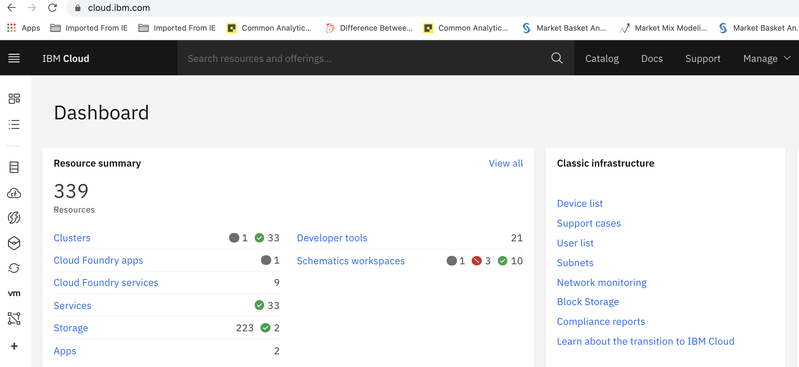

- Click on **Clusters** and select the cluster which you have created under prerequisites. In our case, cluster name is **cp-rhm-poc**.

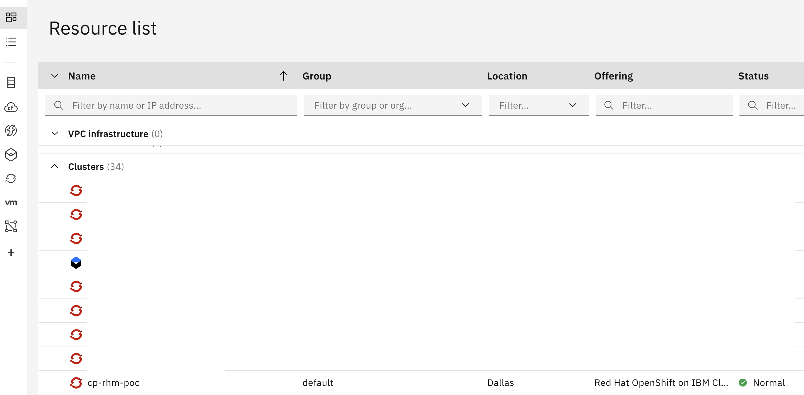

- After you launch the cluster, click on **OpenShift web console** on the top right hand side.

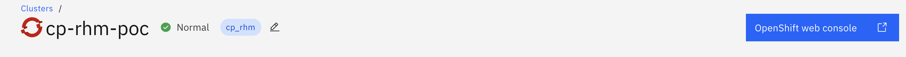

- We can see the RedHat OpenShift Container Platform (Web Console). Click on **question mark icon** on the top right hand side and select **Command Line Tools**. 

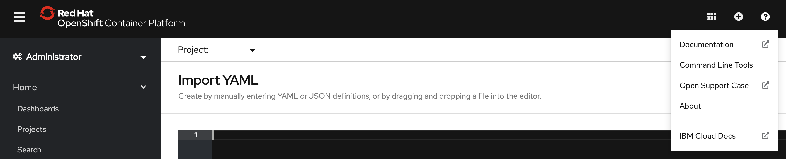

- Navigate to the section `oc - OpenShift Command Line Interface (CLI)` and download the respective oc binary onto your local system. 

**NOTE: This is needed to manage OpenShift projects from a terminal and is further extended to natively support OpenShift Container Platform features.**

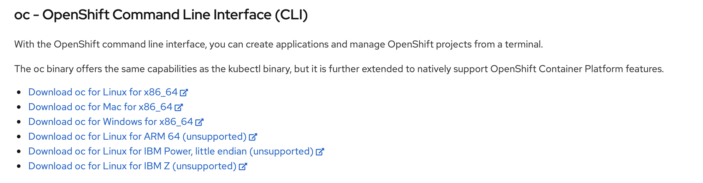

- We are all set to proceed to next step which is to register the OpenShift cluster on RedHat Marketplace platform. 

**NOTE: This is mandatory to install any operators from RedHat Marketplace platform using the OpenShift cluster**.

#### Step 1.2: Register the cluster on RedHat Marketplace

- Sign up and login to RHM portal at [Link](https://marketplace.redhat.com/en-us) and click on **workspace** and then click on cluster. We need to add our new OpenShift cluster and register it on RHM platform.

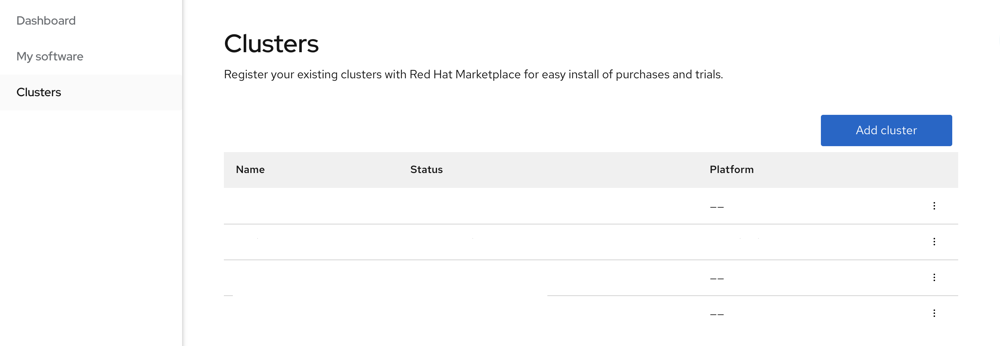

- Update the **cluster name**, generate the pull secret as per the instructions and save it as shown.

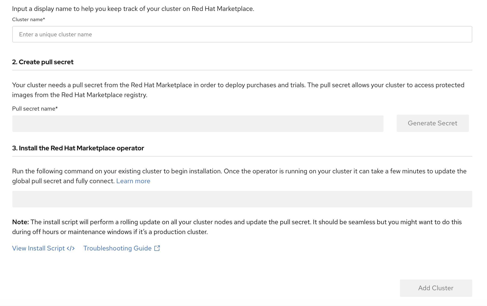

- Copy the curl command which starts with `curl -sL https` and append the pull secret towards the end. 

**NOTE: The entire script should be handy to be used in next step.**

- We need to start the cluster first to register it. Open a terminal and type `oc login`, update the `username` and `password` which are used for accessing the cluster and hit enter. 

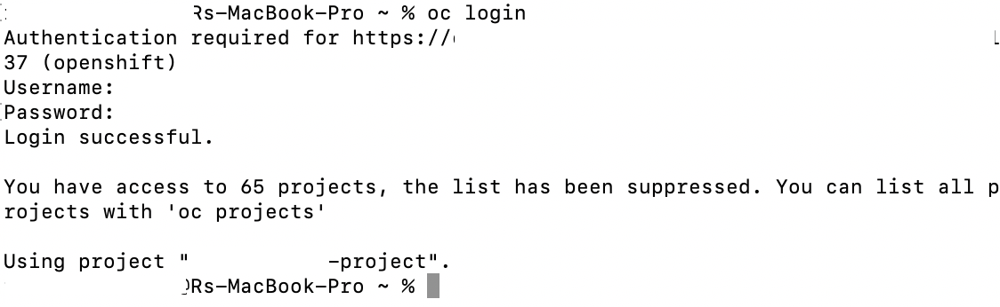

- The cluster is up and running at this point. We need to run the entire script which is from previous step and hit enter. It will take a couple of mins and we can see that we have successfully registered the cluster on RHM portal.

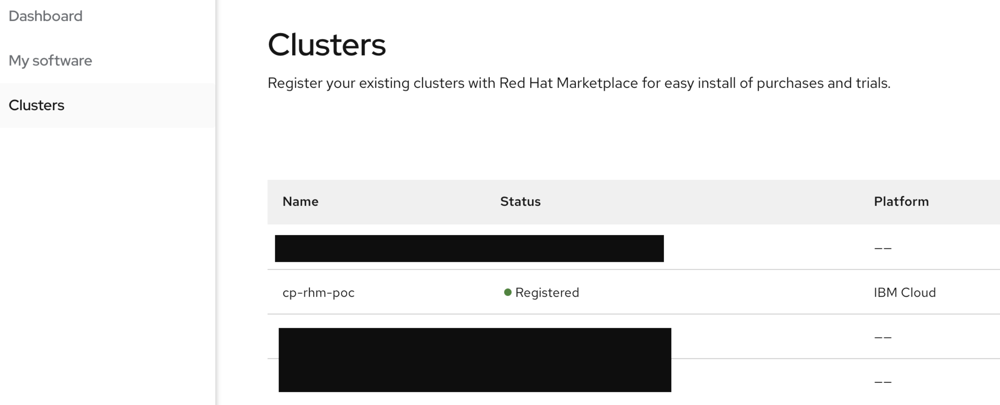

#### Step 1.3: Create a project in web console

- We need to create a project to be used and managed from command line. Click on **Create Project** and give a name as `Cockroachdb-test-project`.

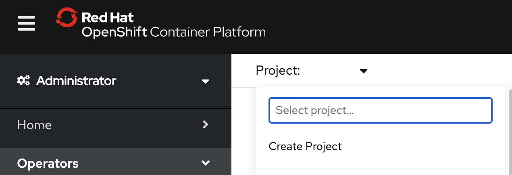

### Step 2: Install the CrunchyDB Operator

- Navigate to **OpenShift web console** which was launched during previous step. Select **operatorhub** under Operators and type 'Crunchy' in the search bar.

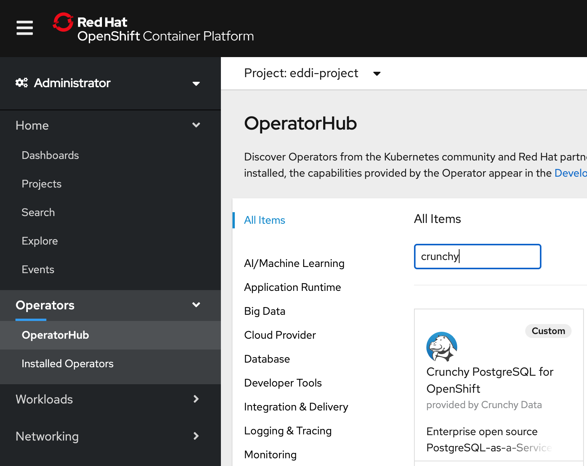

- Click on **Crunchy Postgres Operator** (non custom) and click **install**.

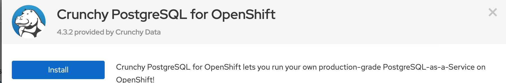

- Create Operator Subscription by choosing All namespaces or specific namespace (select default project crunchy-project) and click **subscribe**.

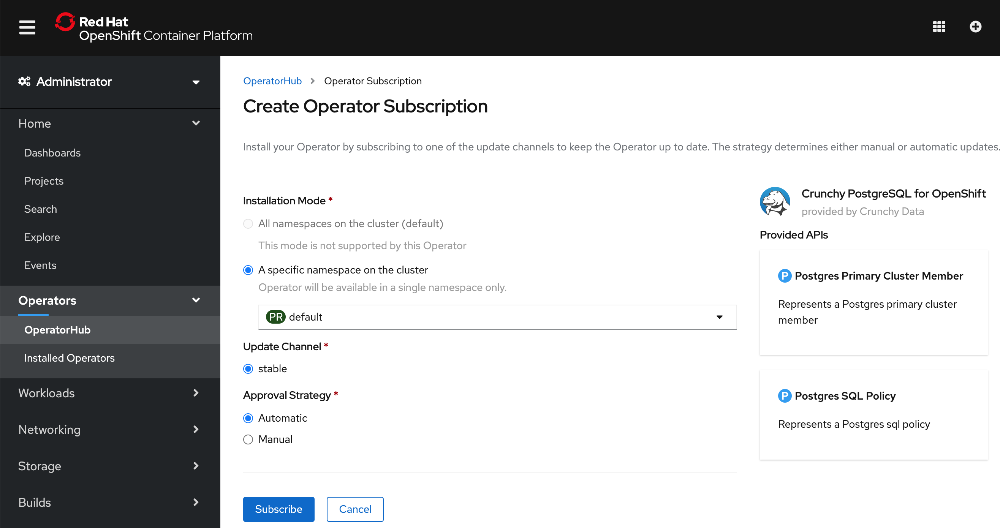

- After a couple of minutes, the operator gets installed on the cluster. We can verify by clicking on Installed Operators under `Operators` and see that the operator is successfully installed with status showing as Succeeded.

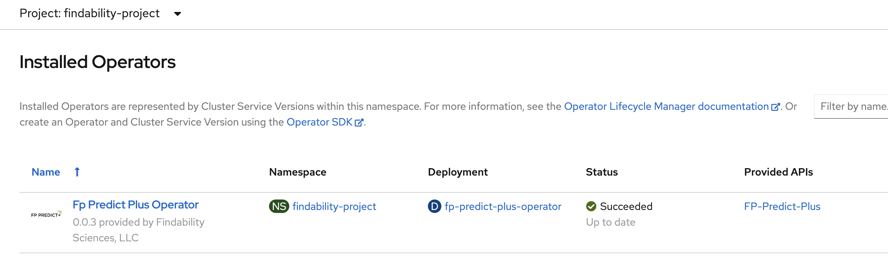

### Step 3: Connect to the Openshift Cluster in CLI (Command Line Interface)

- Login to the ROKS(IBM Managed) Openshift cluster through CLI(command line Iterface). 
To login you would require token which can be genrated after you login to Openshift Cluster web console. See below screenshot to `copy the path`.
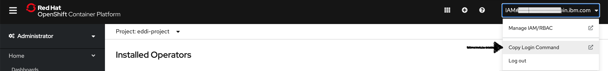

- A new window will open with the login token details. See below screenshot for details. Copy the login token as per the below screenshot.
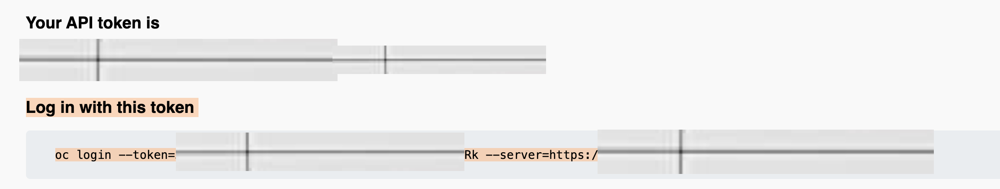

- In terminal, paste the login command, Once you login you would see a similar screen as shown below.
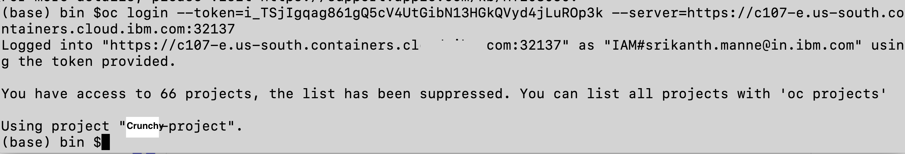

### Step 4: Create and Deploy CrunchyDB Operator on OpenShift Cluster and Create a database.

- (i). Use the new namespace where we have isntalled the Crunchy Postgres operator.
- (ii). Run the below command in CLI(command line Iterface). Once it runs successfully, check for the logs and be sure there are no errors in the ansible script. Wait for the pod state to change to complete state.

``oc create -f postgres-operator.yml`` 

``oc get po
NAME               READY   STATUS      RESTARTS   AGE
pgo-deploy-zl6sz   0/1     Completed   0          24h
``
- (iii). switch to pgo namespace. 

- (iv). Edit `pgo-config configmap` and update `DisableFSGroup` to `false`.

- (v). Restart postgress operator pod. postgres-operator-f7d8c5667-4hhrk

`Note:`Reason for above step (iv, v):
``Crunchy PostgreSQL for Kubernetes is set up to work with the "restricted" SCC by default, but we may need to make modifications. In this mode, we will want to ensure that "DisableFSGroup" is set to false mentioned "pgo-config" ConfigMap.
Making changes to the "pgo-config" ConfigMap, we will have to restart the "postgres-operator" Pod. ``

- (vi). Download the pgo binary mentioned in the [document URL](https://access.crunchydata.com/documentation/postgres-operator/latest/quickstart/)

- (vii). Make sure the pvc are in bound state. Run the below command: 
`oc get pvc`
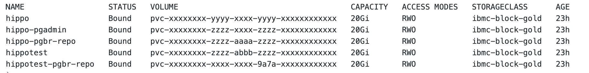

- (viii). Create database using below command.
``pgo create cluster -n pgo hippo``
This will create database (pods) in pgo namespace.

- (ix). To validate run below commands.
    a .`` pgo show cluster -n pgo hippo``
    b.  ``pgo test -n pgo hippo``

Attached is the postgres-operator.yml updated file. (edited) 
[Download postgres-operator.yml](postgres-operator.yml)

### Step 5: Access the cluster on your localhost

- Let us view the results of the commands we ran in the earlier steps via the pgAdmin 4 console. The console can be accessed at localhost with port forwarding.

- Run the following command in Terminal:
```bash
$ pgo create pgadmin hippo
```
- This creates a pgAdmin 4 deployment unique to this PostgreSQL cluster and synchronizes the PostgreSQL user information into it.

- To access pgAdmin 4, you can set up a `port-forward` to the Service, which follows the pattern `<clusterName>-pgadmin`, to port `5050`:
```bash
$ kubectl port-forward -n pgo svc/hippo-pgadmin 5050:5050 
```

```
Forwarding from 127.0.0.1:5050 -> 5050
Forwarding from [::1]:5050 -> 5050
```

- Open <http://localhost:5050> on your browser and use your database username (e.g. `hippo`) and password (e.g. `datalake`) to log in.

 

(Note: if your password does not appear to work, you can retry setting up the user with the [pgo update](https://access.crunchydata.com/documentation/postgres-operator/4.3.2/pgo-client/reference/pgo_update_user/) user command: `pgo update user -n pgo --username=hippo --password=datalake hippo`)

- Once logged in, you can see the pgAdmin 4 console as shown.

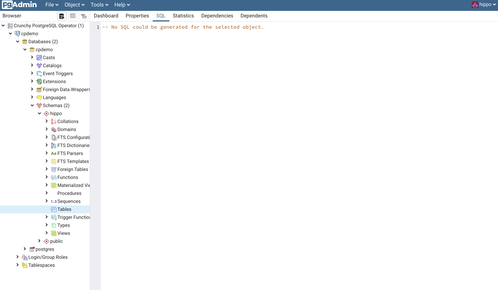

### Step 6: Perform CRUD Operations on CrunchyDB using python

- Once we have the CrunchyDB UP and running, `user` and `database` created, we can now explore the CRUD operations on Crunchy PostgreSQL in a python runtime using Jupyter Notebook.

- In Terminal run the following command to port forward `5432` port from the OpenShift cluster which we will be using in our Jupyter Notebook to establish a connection with the Crunchy PostgreSQL instance.
```bash
$ kubectl port-forward -n pgo svc/hippo 5432:5432 
```

```
Forwarding from 127.0.0.1:5432 -> 5432
Forwarding from [::1]:5432 -> 5432
```

- We will be working with Jupyter Notebook, you can use tools like [Anaconda](https://www.anaconda.com/products/individual) to open the Jupyter Notebook or [install Jupyter Notebook from python-pip](https://jupyter.org/install).

- Download and open the notebook [CrunchyDB CRUD Operations.ipynb](CrunchyDB%20CRUD%20Operations.ipynb) in your local machine.

- Click on the **Cell** tab and click on **Run All** as shown.


- You can now follow the notebook instructions for more details on what is happening in each cell.

- After we have execuited the notebook, we can verify the table in the pgAdmin 4 console. 

- - To access pgAdmin 4, you can set up a `port-forward` to the Service, which follows the pattern `<clusterName>-pgadmin`, to port `5050`:
```bash
$ kubectl port-forward -n pgo svc/hippo-pgadmin 5050:5050 
```

```
Forwarding from 127.0.0.1:5050 -> 5050
Forwarding from [::1]:5050 -> 5050
```

- In the pgAdmin 4 console, expand your `cluster` (eg: in our case `cpdemo`), expand `Databases`, expand `database_name`, expand `Schemas`, expand `username` (eg: in our case `hippo`), expand `Tables`, you can now see the `accounts` table that we created from the notebook. Right click on the `accounts` table and select **View/Edit Data > All Rows** and the table with all rows will be displayed as shown.


>NOTE: You can view this table after each CRUD operation performed in notebook in order to visualize the changes.

 

# Summary

In this tutorial you have learnt the basics of how to use `Crunchy postgreSQL for kubernetes Operator` deployed on OpenShift Cluster. You have learnt how to perform CRUD operations using the `Crunchy postgreSQL for kubernetes Operator` in python.

# Reference

The documentation for [Crunchy PostgreSQL Operator](https://access.crunchydata.com/) is available at,

  - https://access.crunchydata.com/documentation/postgres-operator/latest/

