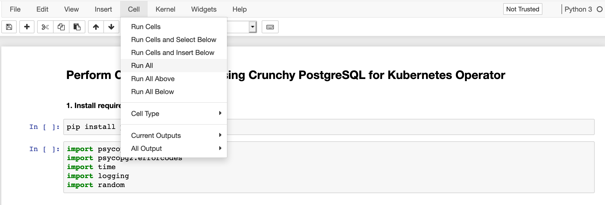
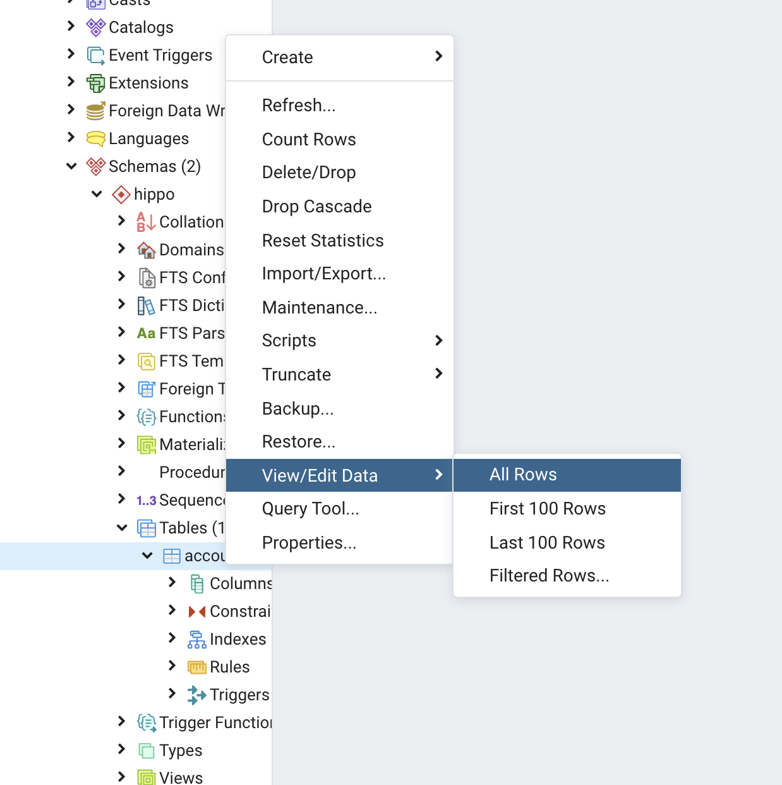
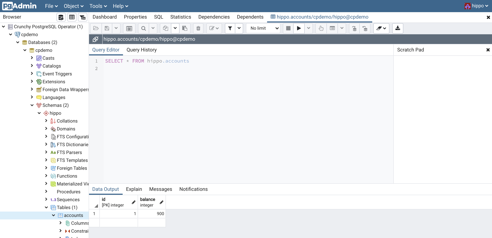

---
#Front matter (metadata).
abstract:               # REQUIRED

authors:
 - name: "Rahul Reddy Ravipally"
   email: "raravi86@in.ibm.com"
 - name: "Manoj Jahgirdar"
   email: "manoj.jahgirdar@in.ibm.com"
 - name: "Srikanth Manne"
   email: "srikanth.manne@in.ibm.com"
 - name: "Manjula G. Hosurmath"
   email: "mhosurma@in.ibm.com"

completed_date: 2020-07-03

components:
- slug: "Crunchy PostgreSQL for Kubernetes"
  name: "Crunchy PostgreSQL for Kubernetes"
  url: "https://marketplace.redhat.com/en-us/products/crunchy-postgresql-for-kubernetes"
  type: "component"
- slug: "redhat-marketplace"
  name: "Red Hat Marketplace"
  url: "https://marketplace.redhat.com/"
  type: "component"

draft: true|false       # REQUIRED

excerpt:                # REQUIRED

keywords:               # REQUIRED - comma separated list

last_updated:           # REQUIRED - Note: date format is YYYY-MM-DD

primary_tag:          # REQUIRED - Note: Choose only only one primary tag. Multiple primary tags will result in automation failure. Additional non-primary tags can be added below.

pta:                    # REQUIRED - Note: can be only one
# For a full list of options see https://github.ibm.com/IBMCode/Definitions/blob/master/primary-technology-area.yml
# Use the "slug" value found at the link above to include it in this content.
# Example (remove the # to uncomment):
 # - "cloud, container, and infrastructure"

pwg:                    # REQUIRED - Note: can be one or many
# For a full list of options see https://github.ibm.com/IBMCode/Definitions/blob/master/portfolio-working-group.yml
# Use the "slug" value found at the link above to include it in this content.
# Example (remove the # to uncomment):
# - "containers"

related_content:        # OPTIONAL - Note: zero or more related content
  - type: announcements|articles|blogs|patterns|series|tutorials|videos
    slug:

related_links:           # OPTIONAL - Note: zero or more related links
  - title:
    url:
    description:

runtimes:               # OPTIONAL - Note: Select runtimes from the complete set of runtimes below. Do not create new runtimes. Only use runtimes specifically in use by your content.
# For a full list of options see https://github.ibm.com/IBMCode/Definitions/blob/master/runtimes.yml
# Use the "slug" value found at the link above to include it in this content.
# Example (remove the # to uncomment):
 # - "asp.net 5"

series:                 # OPTIONAL
 - type:
   slug:

services:               # OPTIONAL - Note: please select services from the complete set of services below. Do not create new services. Only use services specifically in use by your content.
# For a full list of options see https://github.ibm.com/IBMCode/Definitions/blob/master/services.yml
# Use the "slug" value found at the link above to include it in this content.
# Example (remove the # to uncomment):
# - "blockchain"

subtitle:               # REQUIRED

tags:
# Please select tags from the complete set of tags below. Do not create new tags. Only use tags specifically targeted for your content. If your content could match all tags (for example cloud, hybrid, and on-prem) then do not tag it with those tags. Less is more.
# For a full list of options see https://github.ibm.com/IBMCode/Definitions/blob/master/tags.yml
# Use the "slug" value found at the link above to include it in this content.
# Example (remove the # to uncomment):
 # - "blockchain"

title:                  # REQUIRED

translators:             # OPTIONAL - Note: can be one or more
  - name:
    email:

type: tutorial

---

# Perform CRUD operations using Crunchy PostgreSQL for Kubernetes Operator on Red Hat Marketplace

In this tutorial, we demonstrate how to install and get started using the Crunchy Postgres operator operator from RedHat Marketplace (RHM) and also we will learn how to Perform CRUD operations using Crunchy PostgreSQL for Kubernetes Operator hosted on Red Hat marketplace using python runtime and Jupyter notebook.

# About Crunchy PostgreSQL for Kubernetes Operator

Crunchy PostgreSQL for OpenShift Container Platform (OCP) includes Crunchy PostgreSQL Operator and Crunchy PostgreSQL Container Suite supporting hybrid cloud, open source PostgreSQL-as-a-Service. [Learn more](https://marketplace.redhat.com/en-us/products/crunchy-postgresql-for-kubernetes).
The postgres-operator is a controller that runs within a Kubernetes cluster that provides a means to deploy and manage PostgreSQL clusters.
Use the postgres-operator to:
- deploy PostgreSQL containers including streaming replication clusters
- scale up PostgreSQL clusters with extra replicas
- add pgpool, pgbouncer, and metrics sidecars to PostgreSQL clusters
- apply SQL policies to PostgreSQL clusters
- assign metadata tags to PostgreSQL clusters
- maintain PostgreSQL users and passwords
- perform minor upgrades to PostgreSQL clusters
- load simple CSV and JSON files into PostgreSQL clusters
- perform database backups

# Learning objectives

When you have completed this tutorial, you will understand how to:

* Deploy CrunchyDB Operator on OpenShift Cluster
* Create a CrunchyDB cluster and database
* Access the cluster on your localhost
* Perform Create, Read, Update and Delete Operations on CrunchyDB

# Estimated time

Completing this tutorial should take about 30 minutes.


# Pre-requisites

1. [Red Hat Marketplace Account](https://marketplace.redhat.com/en-us/registration/om).
2. [IBM Managed Red Hat OpenShift Cluster](https://cloud.ibm.com/kubernetes/catalog/create?platformType=openshift).
3. For all operators being installed from RHM, IBM managed ROKS OpenShift cluster version 4.3 or higher is mandatory. Please set up Classic cluster using the instructions from this URL.
[Setting up OpenShift Cluster](https://cloud.ibm.com/docs/openshift?topic=openshift-getting-started)
4. [OC & kubectl CLI](https://docs.openshift.com/container-platform/3.6/cli_reference/get_started_cli.html).

# Steps

### Step 1: Install the CrunchyDB Operator from Red Hat Marketplace on OpenShift Cluster

- Steps to Deploy CruchyDB Operator from Red Hat Marketplace on a OpenShift Cluster can be found here,
  - [Steps to Deploy CrunchyDB Operator](https://github.com/IBM/rhm-crunchydb-operator-install-steps)
  
### Step 2: Perform CRUD Operations on CrunchyDB using python

- Once we have the CrunchyDB UP and running, `user` and `database` created, we can now explore the CRUD operations on Crunchy PostgreSQL in a python runtime using Jupyter Notebook.

- In Terminal run the following command to port forward `5432` port from the OpenShift cluster which we will be using in our Jupyter Notebook to establish a connection with the Crunchy PostgreSQL instance.
```bash
$ kubectl port-forward -n pgo svc/hippo 5432:5432 
```

```
Forwarding from 127.0.0.1:5432 -> 5432
Forwarding from [::1]:5432 -> 5432
```

- We will be working with Jupyter Notebook, you can use tools like [Anaconda](https://www.anaconda.com/products/individual) to open the Jupyter Notebook or [install Jupyter Notebook from python-pip](https://jupyter.org/install).

- Download and open the notebook [CrunchyDB CRUD Operations.ipynb](CrunchyDB%20CRUD%20Operations.ipynb) in your local machine.

- Click on the **Cell** tab and click on **Run All** as shown.



- You can now follow the notebook instructions for more details on what is happening in each cell.

- After we have execuited the notebook, we can verify the table in the pgAdmin 4 console. 

- - To access pgAdmin 4, you can set up a `port-forward` to the Service, which follows the pattern `<clusterName>-pgadmin`, to port `5050`:
```bash
$ kubectl port-forward -n pgo svc/hippo-pgadmin 5050:5050 
```

```
Forwarding from 127.0.0.1:5050 -> 5050
Forwarding from [::1]:5050 -> 5050
```

- In the pgAdmin 4 console, expand your `cluster` (eg: in our case `cpdemo`), expand `Databases`, expand `database_name`, expand `Schemas`, expand `username` (eg: in our case `hippo`), expand `Tables`, you can now see the `accounts` table that we created from the notebook. Right click on the `accounts` table and select **View/Edit Data > All Rows** and the table with all rows will be displayed as shown.



>NOTE: You can view this table after each CRUD operation performed in notebook in order to visualize the changes.

 

# Summary

In this tutorial you have learnt the basics of how to use `Crunchy postgreSQL for kubernetes Operator` deployed on OpenShift Cluster. You have learnt how to perform CRUD operations using the `Crunchy postgreSQL for kubernetes Operator` in python.

# Reference

The documentation for [Crunchy PostgreSQL Operator](https://access.crunchydata.com/) is available at,

  - https://access.crunchydata.com/documentation/postgres-operator/latest/

